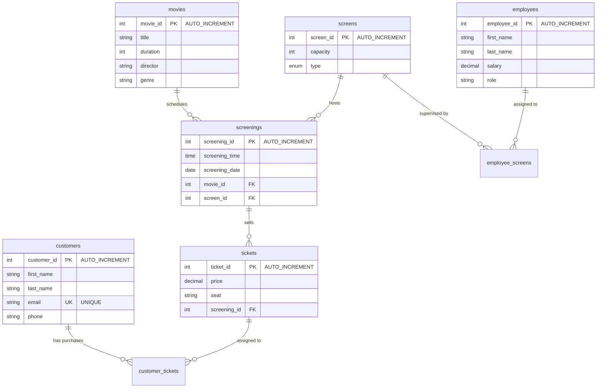

# Cinema Database Manager


**Cinema Database Manager** is a high-performance database management system and command-line utility built to handle movie theater operations (ticketing, schedules, catalog management, and employee assignment). Designed with **Clean Code** principles, it implements a secure data-access layer that interfaces with a relational MySQL database.

---

## Technical Highlights

This project serves as a portfolio showcase demonstrating the implementation of advanced software engineering patterns, secure database integration, and architectural separation of concerns:

### 🛡️ Parameterized SQL Queries (SQL Injection Prevention)
Security is implemented by separating SQL code from user-supplied parameters. Rather than using vulnerable string interpolation or concatenation, all operations in the data layer (such as customer registration or adding movies) utilize placeholders (`%s`). Parameters are passed as tuples to the MySQL driver, ensuring the database engine treats input strictly as data rather than executable statements.
```python
# Secure query pattern used throughout the app
query = "INSERT INTO movies (title, duration, director, genre) VALUES (%s, %s, %s, %s)"
cursor.execute(query, (title, duration, director, genre))
```

### ⚡ Connection Pooling
To optimize memory usage and database response time, the project utilizes MySQL's `pooling` module. Rather than incurring the heavy cost of opening and tearing down a TCP connection for every query, the application maintains a configurable connection pool (`CinemaConnectionPool`). It reuses active connections, drastically decreasing latency under load and managing database socket resource limits efficiently.

### 🔄 Transaction Management (ACID Compliance)
The system ensures database state consistency during complex workflows using atomic transactions. For instance, when booking a ticket, the application must perform two writes: insert the ticket details into `tickets` and associate the customer in the `customer_tickets` join table.
If any step fails, the system executes a rollback (`connection.rollback()`), aborting all changes to guarantee that orphan ticket records are never created.
```python
try:
    connection.start_transaction()
    # 1. Insert ticket details
    # 2. Insert join-table record
    connection.commit()
except Error as e:
    connection.rollback() # Preserves ACID integrity
```

### 📐 Relational Database Design
The schema features an optimized relational design incorporating multiple constraints:
- **Foreign Keys with Cascade Actions**: `ON DELETE CASCADE` is set on foreign keys to automatically clean up schedules, tickets, and bookings when parent movies or screens are removed, maintaining referential integrity.
- **Join Tables (Many-to-Many Relationships)**: Resolves many-to-many relationships such as Customers to Tickets (`customer_tickets`) and Employees to Screens (`employee_screens`).
- **Data Integrity Constraints**: Strict ENUM types enforce formats (e.g. `type ENUM('2D', '3D', 'IMAX')` for screens) and columns are flagged `NOT NULL` appropriately.

---

## Repository Structure

The project has been refactored to separate the UI and presentation logic (View) from the configuration and MySQL data retrieval layers (Model):

```text
cinema-database-manager/
├── .gitignore             # Strict exclusions for Python cache, envs, and secrets
├── LICENSE                # MIT License
├── README.md              # Project documentation (Recruiter facing)
├── requirements.txt       # Production dependencies
├── db/
│   ├── schema.sql         # Relational database schema definition
│   └── seed.sql           # English seed dataset (23 movies, screens, customers, etc.)
├── src/
│   ├── __init__.py        # Package constructor
│   ├── cli.py             # CLI View Controller (ASCII layouts, menu, input validation)
│   ├── config.py          # Secure configuration loading (supports env variables)
│   ├── database.py        # Model Data-Access Layer (Connection pooling, parameterized queries)
│   └── main.py            # App entrypoint
└── tests/
    ├── __init__.py        # Test package marker
    └── test_database.py   # Automated Unit tests (mocks connection & verifies transaction rollbacks)
```

---

## Database Schema (ER Summary)



---

## Setup & Compilation

### Prerequisites
- **Python**: version 3.8 or higher.
- **MySQL/MariaDB**: Local server instance.

### 1. Database Setup
Log into your MySQL command-line client or server management tool (e.g., phpMyAdmin, DBeaver) and import the schema and seed files:

```bash
# Log in and import the relational schema
mysql -u root -p < db/schema.sql

# Load the test dataset (sample records in English)
mysql -u root -p < db/seed.sql
```

### 2. Application Installation
Clone the repository and install dependencies:

```bash
# Clone the repository
git clone https://github.com/Zintradev/cine-db-sqltest.git cinema-database-manager
cd cinema-database-manager

# Create and activate virtual environment
python -m venv .venv
# On Windows:
.venv\Scripts\activate
# On macOS/Linux:
source .venv/bin/activate

# Install required packages
pip install -r requirements.txt
```

### 3. Environment Configuration (Optional)
To avoid committing database passwords to GitHub, configure connection parameters in a local `.env` file in the root folder:

```ini
DB_HOST=localhost
DB_PORT=3306
DB_USER=root
DB_PASSWORD=your_password
DB_NAME=cinema_db
```

---

## Execution Guide

### Running the Application
Launch the interactive command-line interface:
```bash
python src/main.py
```

### Running Unit Tests
A comprehensive test suite is included to run tests offline (using mocks) without needing a database connection:
```bash
python -m unittest discover -s tests
```

---

## Console Controls & Usage

Upon execution, the terminal loads an interactive prompt with strict inputs parsing:

| Option | Operation Name | Description | Database Impact |
| :--- | :--- | :--- | :--- |
| **1** | **List All Movies** | Displays the full active movie catalog ordered alphabetically by title. | `SELECT` on `movies` |
| **2** | **View Revenue Report** | Shows total tickets sold and overall financial revenues grouped by movie title. | `SELECT` joining `movies`, `screenings`, `tickets` |
| **3** | **Add New Movie** | Guides through title, duration, director, and genre inputs to add a new movie. | `INSERT` (parameterized) on `movies` |
| **4** | **Register Customer** | Registers a user's details (email uniqueness constraint checked). | `INSERT` (parameterized) on `customers` |
| **5** | **View Schedule** | Lists scheduled screenings mapping times, dates, movies, and screen specs. | `SELECT` joining `screenings`, `movies`, `screens` |
| **6** | **Book a Ticket** | Purchases a ticket for a user. Demonstrates transactional safety. | Dual `INSERT` within transaction block |
| **7** | **Exit** | Shuts down database connections safely and closes the program. | Shuts down connection pool |
