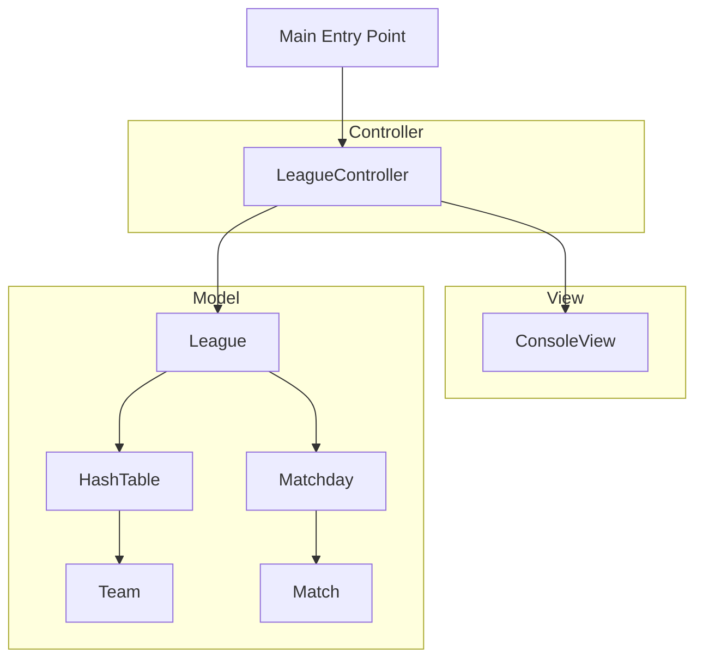

# League Simulator

[](https://www.oracle.com/java/)
[](https://maven.apache.org/)
[](https://junit.org/junit5/)
[](LICENSE)

A clean, robust, and decoupled Java console application that simulates sports league seasons. It manages team registrations, constructs balanced round-robin match schedules, generates scores, and compiles real-time league standings using custom-built data structures.

---

## 🏆 Project Architecture

This project is refactored from a legacy academic codebase into a modern, industry-standard structure following the **Model-View-Controller (MVC)** architectural pattern. 



- **Model Layer (`com.leaguesimulator.model`)**: Contains pure domain logic and state (`Team`, `League`, `Match`, `Matchday`). It maintains 100% decoupling from console output (`System.out`) and inputs (`Scanner`), making the core engine fully reusable and unit-testable.
- **View Layer (`com.leaguesimulator.view`)**: Houses `ConsoleView`, which is solely responsible for rendering formatted ASCII tables, matchday summaries, and prompting the user for CLI input.
- **Controller Layer (`com.leaguesimulator.controller`)**: Led by `LeagueController`, it manages application flow, handles user menu choices, feeds initial seed data, and directs model updates to the view.

---

## 🚀 Technical Highlights

This project serves as a portfolio piece showcasing advanced software engineering concepts, custom data structures, and defensive programming:

### 1. Custom HashTable with Collision Resolution (Quadratic Probing)
Rather than relying on `java.util.HashMap`, this project features a **custom Hash Table** implementation (`HashTable.java`) built from scratch to demonstrate low-level memory allocation and hashing understanding:
- **Hashing Function**: Translates variable-length string IDs into a `long` value using a polynomial multiplication hash (`hashValue = hashValue * 29 + charAt(j)`) and maps it into index limits using modular arithmetic.
- **Collision Resolution**: Employs **Quadratic Probing** ($index = (baseIndex + i^2) \pmod{capacity}$) where $i$ is the collision probe count. This prevents primary clustering, which commonly occurs in linear probing.
- **Load Factor Monitoring**: Implements active load factor calculation ($\text{Load Factor} = \frac{\text{size}}{\text{capacity}}$). When the load factor exceeds a threshold of $80\%$ ($0.8$), the HashTable notifies the Controller to issue a warning, indicating that table resizing is required for efficiency.

### 2. Balanced Round-Robin Scheduling (Berger / Circle Method)
The match generation in `League.java` implements a round-robin schedule using the **Circle Method** (or Berger Tables) to ensure every team plays every other team exactly once per phase (home/away):
- **Algorithm**: In a league of $N$ teams, one team is fixed, and the remaining $N-1$ teams are rotated circularly after each round.
- **Home/Away Balance**: Alternates the home/away designation of teams on consecutive matchdays to avoid unfair scheduling streaks.
- **Dummy Team ("Bye") Integration**: Gracefully handles odd numbers of teams by introducing a virtual "Bye" team. Matches with the "Bye" team are automatically omitted from the schedule.

### 3. High-Quality Unit Testing
Includes automated test suites under `src/test/java` using **JUnit 5** to test:
- HashTable insertions, deletions, search, and collision resolution.
- League scheduling (verifying the correct number of rounds for both odd and even team counts).
- Standings sorting logic (sorting teams descending by Points, then Goal Difference, and finally Goals Scored).

### 4. Critical Legacy Bug Fixes
Refactored and resolved two critical bugs from the original academic codebase:
*   🐛 **Odd-Team Standings Leak**: In the legacy code, shuffling teams before the second leg caused the dummy "Descanso" team to swap places. When the code attempted to remove the dummy team by index (`size - 1`), it removed a real team instead, leaving the dummy team in the final standings. This was fixed by using safe element-based filtering (`removeIf`).
*   🐛 **Duplicate ID Check Bypass**: The legacy code asked the user for a Team ID but ignored it when creating the team (which generated a timestamp-based ID instead). Consequently, checks for duplicate IDs failed, permitting teams with identical IDs. This was solved by ensuring the ID provided by the user is correctly mapped to the `Team` constructor.

---

## 🎮 CLI Controls & Menu Usage

When you run the application, you are presented with an interactive CLI menu:

| Option | Command | Description |
| :--- | :--- | :--- |
| **`1`** | **Insert Team** | Prompts for a unique Team ID (e.g. `E9`) and a Team Name. Validates input and warns if the custom Hash Table exceeds 80% load capacity. |
| **`2`** | **Run League Simulation** | Generates the entire season (First and Second Legs), runs randomized goal results for all matches, and displays the formatted standings table. |

---

## 🛠️ Compilation & Execution

### Prerequisites
- **Java JDK 17** or higher.
- **Maven** (optional, for dependencies and build orchestration).

### Build & Run with Maven (Recommended)
1. **Clone the Repository**:
   ```bash
   git clone https://github.com/Zintradev/LeagueSimulator.git
   cd LeagueSimulator
   ```
2. **Build and Compile**:
   ```bash
   mvn clean compile
   ```
3. **Run Unit Tests**:
   ```bash
   mvn test
   ```
4. **Execute the Application**:
   ```bash
   mvn exec:java
   ```

### Compile & Run Manually (No Maven required)
If you do not have Maven installed, you can compile and run the application using the standard Java CLI tools:

1. **Compile**:
   ```bash
   javac -d target/classes src/main/java/com/leaguesimulator/model/*.java src/main/java/com/leaguesimulator/view/*.java src/main/java/com/leaguesimulator/controller/*.java src/main/java/com/leaguesimulator/Main.java
   ```
2. **Run**:
   ```bash
   java -cp target/classes com.leaguesimulator.Main
   ```
